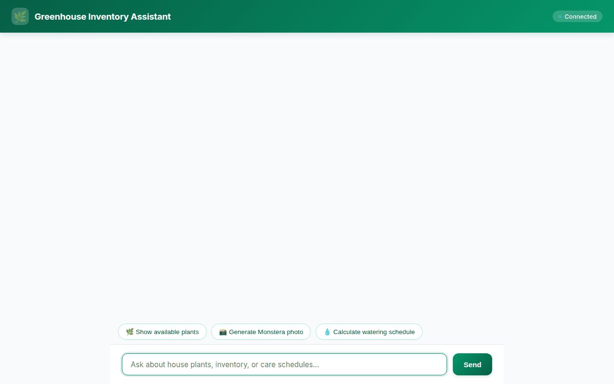

# 🌿 Greenhouse Inventory Assistant

An intelligent, AI-powered greenhouse inventory management assistant built with the **Agent Development Kit (ADK)**, Google Cloud Vertex AI, Firestore, and Gemini models.



---

## 🚀 Overview

The **Greenhouse Inventory Assistant** helps greenhouse managers, plant enthusiasts, and botanical staff monitor plant stock, generate AI plant photos and short growth videos, locate nearby nurseries, calculate customized care and watering schedules, and maintain cross-session user preferences and allergy records.

The application features a sleek botanical frontend proxy talking to an ADK Reasoning Engine backend via the **Agent-to-Agent (A2A)** protocol, rendering adaptive **A2UI v0.8** rich card components in real-time.

---

## ⚡ Wired Tools & Integrated Google Cloud Services

The assistant strictly integrates the following production services and custom tools:

### 1. 🧠 Vertex AI Memory Bank (`VertexAiMemoryBankService`)
- Persists user state, greenhouse preferences, and **user allergies** (such as pollen sensitivities, latex/sap allergies, or chemical/fertilizer sensitivities) across chat sessions.

### 2. 🗄️ Cloud Firestore Database (`firestore_service.py`)
- Real-time catalog management and inventory tracking:
  - `list_inventory`: Query available house plants and stock levels.
  - `get_item`: Inspect detailed plant inventory records.
  - `update_inventory_quantity`: Adjust stock quantities upon sales or restocks.
  - `add_inventory_item`: Register new plant species into the greenhouse database.

### 3. ☁️ Google Cloud Storage Bucket (`image_generator.py` & `video_generator.py`)
- Public asset hosting for AI-generated visual content:
  - Direct uploads of generated images and videos to a public GCS bucket (`greenhouse-inventory-assets-...`).
  - Returns public HTTPS media URLs directly consumable by web clients and A2UI Image components.

### 4. 🎨 Gemini Multimodal Generation Models
- **Image Generation (`image_generator.py`)**: Uses `gemini-3.1-flash-lite-image` to generate plant visualization photos, saving artifacts to `ToolContext` and GCS.
- **Video Generation (`video_generator.py`)**: Uses Google's **`gemini-omni-flash-preview`** in the `global` region via the `Interactions` API to generate short AI videos of greenhouse items.

### 5. 🗺️ Google Maps Platform (`maps_tools.py`)
- Spatial location services:
  - `geocode_address`: Geocode greenhouse or customer locations into coordinates.
  - `find_nearby_places`: Discover nearby plant nurseries, garden centers, and agricultural suppliers.

### 6. 🌿 Botanical Taxonomy & Care Calculator
- `fetch_botanical_taxonomy`: Fetches botanical family, genus, and scientific classification data (`plant_taxonomy.py`).
- `calculate_watering_schedule`: Computes optimal watering intervals in days based on plant species, ambient temperature (°F), and humidity (%).

### 7. 🃏 A2UI v0.8 Rich Component Rendering (`a2ui_utils.py`)
- Powered by `A2uiSchemaManager` and `BasicCatalog` (v0.8).
- Transforms agent outputs into structured UI cards (Card, Column, Row, Text, Image) rendered dynamically in the chat UI.

---

## 📋 Planned / Not Yet Implemented

The following features were outlined in initial design concepts but are **not yet implemented** in the current codebase:

- ❌ *Automated IoT Soil Moisture Sensor Sync*: Hardware integration with physical greenhouse moisture probes.
- ❌ *Barcode / RFID Scanner Integration*: Handheld scanner hardware input for warehouse logistics.
- ❌ *Automated Purchase Order EDI*: B2B automatic ordering with wholesale plant distributors.

---

## 🛠️ Local Setup & Execution Instructions

### Prerequisites
- Python 3.11+
- Google Cloud Project with Vertex AI, Firestore, and Cloud Storage APIs enabled
- `gcloud` authenticated CLI

### 1. Environment Setup
```bash
# Clone repository and enter project folder
cd demo-agent

# Create virtual environment and install dependencies
python3 -m venv .venv
source .venv/bin/activate
pip install -r requirements.txt
```

### 2. Run Agent Engine Local Playground
```bash
# Start ADK local playground server
agents-cli playground
```

### 3. Run FastAPI Proxy Frontend
```bash
# Set environment variables pointing to Reasoning Engine metadata & directory
export AGENT_ENGINE_RESOURCE_NAME="projects/<PROJECT_ID>/locations/<REGION>/reasoningEngines/<REASONING_ENGINE_ID>"
export AGENT_DIRECTORY="app"

# Start frontend proxy server
cd frontend
pip install -r requirements.txt
uvicorn main:app --host 0.0.0.0 --port 8080
```
Open a browser and navigate to the port `8080` server address to interact with the chat UI.

---

## 📦 Deployment

### Deploy Backend Agent to Agent Runtime
```bash
agents-cli deploy
```

### Deploy Frontend Proxy to Cloud Run
```bash
cd frontend
gcloud run deploy demo-agent-frontend \
  --source . \
  --region us-east1 \
  --allow-unauthenticated \
  --set-env-vars AGENT_ENGINE_RESOURCE_NAME="$AGENT_ENGINE_RESOURCE_NAME",AGENT_DIRECTORY="$AGENT_DIRECTORY"
```
